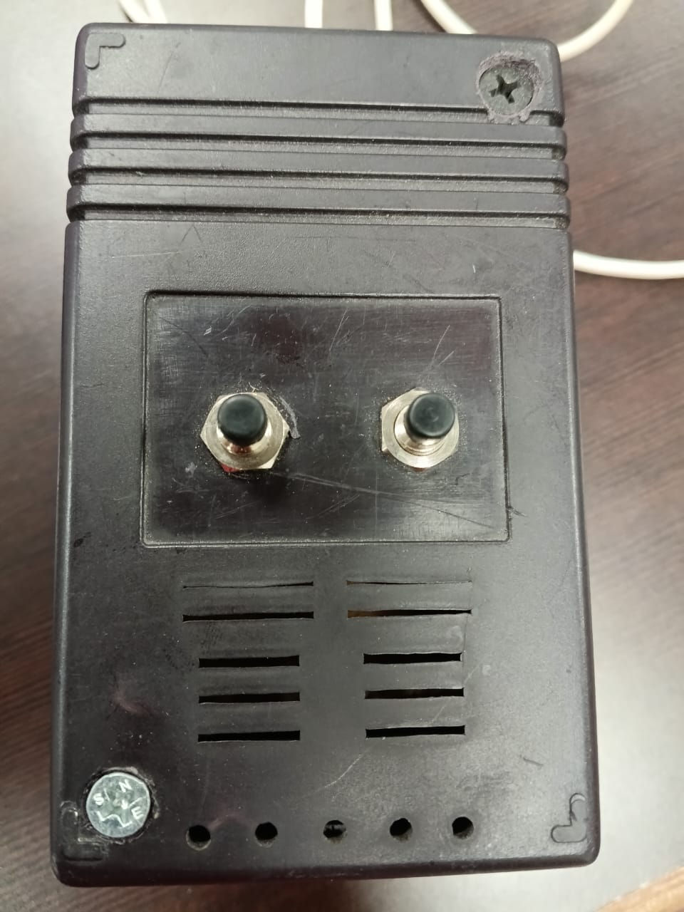
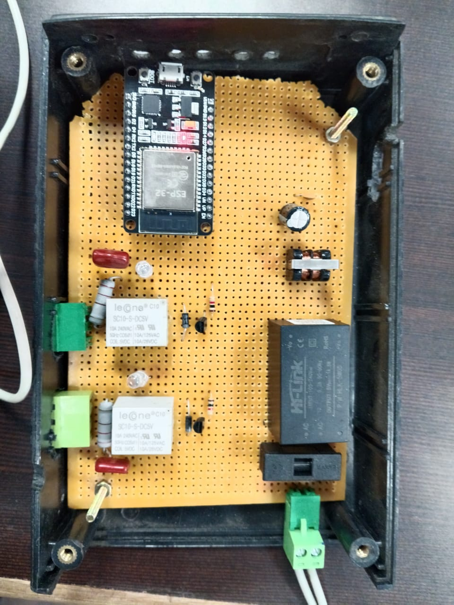
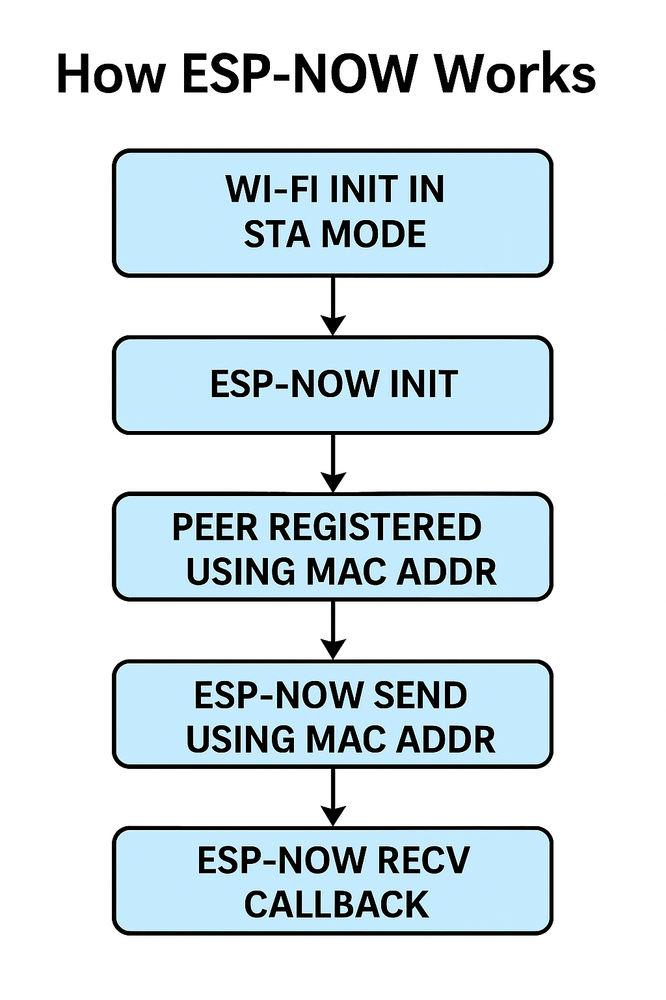

#  ESP32 Wireless Lift Control System (ESP-NOW Based)

This project demonstrates a **low-latency**, **safe**, and **Wi-Fi-independent** lift control system using two ESP32 boards via **ESP-NOW communication protocol**.

##  Project Overview

- **Sender Unit**: Push-button interface to control lift direction.
- **Receiver Unit**: Relay interface to control actual lift motors.
- **Protocol**: ESP-NOW (2.4 GHz, peer-to-peer)
- **Safety**:
  - Only one relay activates at a time.
  - If signal is lost or sender is powered off → Receiver stops immediately (heartbeat timeout).
  - Holding the button keeps relay ON; releasing turns it OFF.

---

##  Hardware Used

| Module          | Sender             | Receiver           |
|-----------------|--------------------|--------------------|
| ESP32 Dev Board | YES                 | YES                 |
| Push Buttons    | 2 (GPIO14, 27)     | NO                |
| Relays          | NO                 | 2-channel (GPIO18, 19) |
| Power Supply    | 5V USB or Adapter  | 5V Relay-powered   |
| Enclosure       | Custom 3D printed case (Sender + Receiver)

---

##  How It Works

- **Sender** reads buttons every 100ms and sends their states + a timestamp (`millis()`).
- **Receiver** listens to sender data and mirrors button presses to relays.
- If no message is received within 300ms → all relays turn OFF for safety.

---

##  Struct Used

```cpp
typedef struct struct_message {
  bool btn1Hold;
  bool btn2Hold;
  unsigned long timestamp;
} struct_message;
```

Used to package and send the state of both buttons and the current `millis()` value to ensure heartbeat timing.

---

##  Heartbeat Explanation

- **Purpose**: Detect communication loss.
- **Logic**: If the time since the last received message exceeds `300ms`, the receiver turns OFF all relays.
- `millis()` provides system uptime used for timing.

---

##  Demo & Visuals

###  Sender in Enclosure (With Buttons)


###  Receiver Relay Board


###  ESP-NOW Wireless Communication


###  Functional Flowchart


---

##  Safety Features Summary

- One relay ON at a time (Button 1 locks out Button 2).
- Real-time heartbeat check ensures safe operation.
- Releasing button → relay OFF instantly.
- No Wi-Fi required. Reliable in field conditions.

---

## 🧑‍💻 Developed By

**Naveen Kumar S.**  
📍 Coimbatore, India  
🔗 GitHub: [Naveendev360](https://github.com/Naveendev360))  
🔗 LinkedIn: [Naveen-kumar](https://www.linkedin.com/in/naveen-kumar-31a168251/)

---

## ⚠️ Disclaimer

This project is intended for **educational and prototyping purposes**. Exercise **electrical safety** when dealing with relays and high-voltage equipment.

---

##  Status

🟢 Fully Working 
🔁 Long Range 
⏱️ Ultra Low Latency 
🔐 Safe

---

## 📄 License

This project is licensed under the **MIT License**.

```
MIT License

Copyright (c) 2025 Naveen Kumar

Permission is hereby granted, free of charge, to any person obtaining a copy
of this software and associated documentation files (the “Software”), to deal
in the Software without restriction, including without limitation the rights
to use, copy, modify, merge, publish, distribute, sublicense, and/or sell
copies of the Software, and to permit persons to whom the Software is
furnished to do so, subject to the following conditions:

The above copyright notice and this permission notice shall be included in
all copies or substantial portions of the Software.

THE SOFTWARE IS PROVIDED “AS IS”, WITHOUT WARRANTY OF ANY KIND, EXPRESS OR
IMPLIED, INCLUDING BUT NOT LIMITED TO THE WARRANTIES OF MERCHANTABILITY,
FITNESS FOR A PARTICULAR PURPOSE AND NONINFRINGEMENT. IN NO EVENT SHALL THE
AUTHORS OR COPYRIGHT HOLDERS BE LIABLE FOR ANY CLAIM, DAMAGES OR OTHER
LIABILITY, WHETHER IN AN ACTION OF CONTRACT, TORT OR OTHERWISE, ARISING FROM,
OUT OF OR IN CONNECTION WITH THE SOFTWARE OR THE USE OR OTHER DEALINGS IN
THE SOFTWARE.
```
