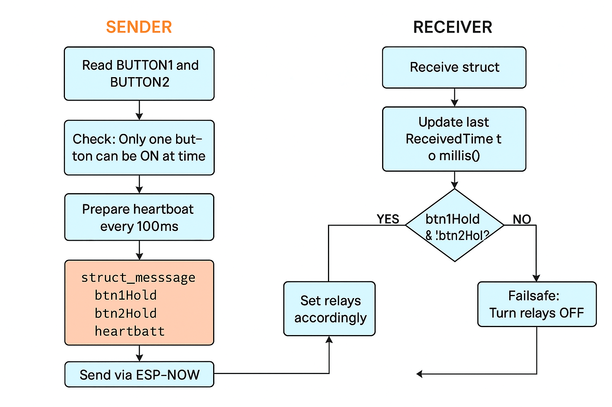

# 🚀 ESP32 Wireless Lift Control System (ESP-NOW Based)

This project demonstrates a **low-latency**, **safe**, and **Wi-Fi-independent** lift control system using two ESP32 boards via **ESP-NOW communication protocol**.

## 🛠️ Project Overview

- **Sender Unit**: Push-button interface to control lift direction.
- **Receiver Unit**: Relay interface to control actual lift motors.
- **Protocol**: ESP-NOW (2.4 GHz, peer-to-peer)
- **Safety**:
  - Only one relay activates at a time.
  - If signal is lost or sender is powered off → Receiver stops immediately (heartbeat timeout).
  - Holding the button keeps relay ON; releasing turns it OFF.

---

## 📦 Hardware Used

| Module          | Sender             | Receiver           |
|-----------------|--------------------|--------------------|
| ESP32 Dev Board | ✅                 | ✅                 |
| Push Buttons    | 2 (GPIO14, 27)     | ❌                 |
| Relays          | ❌                 | 2-channel (GPIO18, 19) |
| Power Supply    | 5V USB or Adapter  | 5V Relay-powered   |
| Enclosure       | Custom 3D printed case (Sender + Receiver)

---

## 📡 How It Works

- **Sender** reads buttons every 100ms and sends their states + a timestamp (`millis()`).
- **Receiver** listens to sender data and mirrors button presses to relays.
- If no message is received within 300ms → all relays turn OFF for safety.

---

## 🧠 Process Flow Diagram

```mermaid
flowchart TD
  A[Button Press on Sender] --> B[ESP32 Reads Button State]
  B --> C[Create struct with btn1, btn2, millis()]
  C --> D[Send data via ESP-NOW]
  D --> E[Receiver ESP32 Receives Packet]
  E --> F[Check millis() for heartbeat]
  F --> G[Control Relay1 or Relay2]
  G --> H[Safety Logic: One Relay ON at a Time]
  F --> I{If No Data in 300ms?}
  I -->|Yes| J[Turn OFF All Relays]
  I -->|No| G
```

---

## 🧱 Struct Used

```cpp
typedef struct struct_message {
  bool btn1Hold;
  bool btn2Hold;
  unsigned long timestamp;
} struct_message;
```

Used to package and send the state of both buttons and the current `millis()` value to ensure heartbeat timing.

---

## ⏱️ Heartbeat Explanation

- **Purpose**: Detect communication loss.
- **Logic**: If the time since the last received message exceeds `300ms`, the receiver turns OFF all relays.
- `millis()` provides system uptime used for timing.

---

## 📷 Demo & Visuals

### 🔘 Sender in Enclosure (With Buttons)


### ⚡ Receiver Relay Board


### 📶 ESP-NOW Wireless Communication


### 📊 Functional Flowchart


---

## 🔐 Safety Features Summary

- One relay ON at a time (Button 1 locks out Button 2).
- Real-time heartbeat check ensures safe operation.
- Releasing button → relay OFF instantly.
- No Wi-Fi required. Reliable in field conditions.

---

## 📂 File Structure

```
/ESP32-Lift-Control/
│
├── sender/
│   └── sender.ino
├── receiver/
│   └── receiver.ino
├── assets/
│   ├── sender_case.png
│   ├── receiver_relay.png
│   ├── espnow_flow.png
│   └── flowchart.png
└── README.md
```

---

## 🧑‍💻 Developed By

**Naveen Kumar S.**  
📍 Coimbatore, India  
🔗 GitHub: [Navz360](https://github.com/Navz360)  
🔗 LinkedIn: [naveen-kumar](https://linkedin.com/in/naveen-kumar)

---

## ⚠️ Disclaimer

This project is intended for **educational and prototyping purposes**. Exercise **electrical safety** when dealing with relays and high-voltage equipment.

---

## ✅ Status

🟢 Fully Working | 🔁 Long Range | ⏱️ Ultra Low Latency | 🔐 Safe
